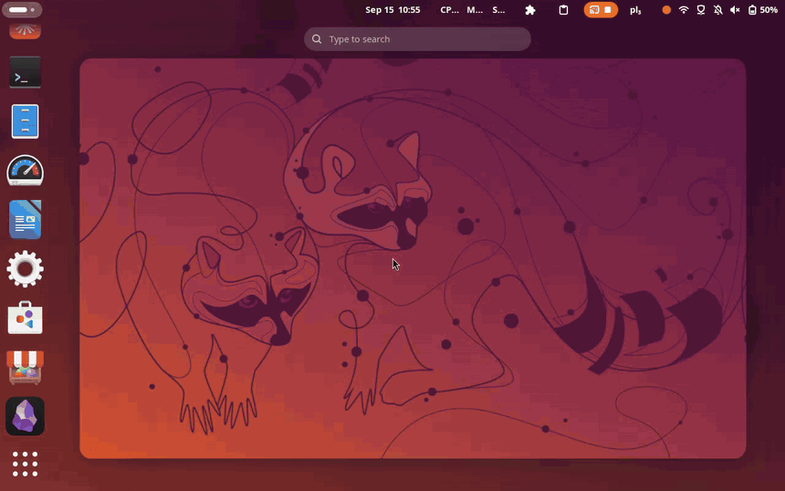

# Search Does Search

**Web results directly in system search.**

Press Super, type, and the engine's own results page renders right there in the
GNOME overview — scroll it, click it, follow the links you click without ever
leaving it. Nothing is handed to a browser until you ask for it, and which
browser that is stays your system default.



---

## Features

- Intercepts queries in the GNOME Activities search bar
- Shows the engine's **rendered results page inside the overview** — scroll it, click it, use the keyboard in it
- **Follows the links you click, in place**, with a back control counting how many pages deep you are — or hands them to your browser, whichever you set
- Opens in your **default browser** when you ask it to (Firefox, Chrome, Brave, Chromium — anything)
- Decides for itself **when to appear**: every search, or only when nothing else matched
- Queries never touch a third party you did not choose
- Debounces keystrokes, and warms the renderer while the overview opens
- Works on X11 and Wayland
- Compatible with GNOME Shell 48, 49 and 50

---

## Requirements

- GNOME Shell 48, 49 or 50
- The WebKit2 4.1 GJS typelib — the renderer process:
  `gir1.2-webkit2-4.1` on Debian/Ubuntu, `webkit2gtk4.1` on Fedora.
  The packages below depend on it; the zip and source installs do not, so
  install it yourself if the section reports the renderer is missing.
- Node.js 20+ *(only to build from source)*

No account, no API key, and no service of your own to run.

---

## Installation

Five ways in. They differ in who owns the upgrade, which is the part worth
choosing on:

| Method | Scope | Upgrades | Root |
|---|---|---|---|
| **APT repository** | system | `apt upgrade`, with everything else | yes |
| **DNF repository** | system | `dnf upgrade`, with everything else | yes |
| A single `.deb` / `.rpm` | system | nothing — you re-download | yes |
| The extension `.zip` | your user | nothing — you re-download | no |
| From source | your user | `git pull && make install` | no |

The repositories are the ones to prefer, and not only for the upgrades: they are
the only methods that *declare* the WebKit2 4.1 typelib the renderer needs, so
the extension either installs working or refuses to install. Every other method
will install happily on a machine that cannot render a page.

### Debian, Ubuntu, and derivatives

```bash
sudo install -d -m 0755 /etc/apt/keyrings
curl -fsSL https://dixonsolutions.github.io/searchDOESsearch/KEY.gpg \
  | sudo tee /etc/apt/keyrings/searchdoessearch.asc > /dev/null
echo "deb [signed-by=/etc/apt/keyrings/searchdoessearch.asc] https://dixonsolutions.github.io/searchDOESsearch/deb stable main" \
  | sudo tee /etc/apt/sources.list.d/searchdoessearch.list > /dev/null
sudo apt update && sudo apt install gnome-shell-extension-search-does-search
```

On apt 2.4 and newer you can use the deb822 form instead, which keeps the key
reference and the source in one file:

```bash
sudo install -d -m 0755 /etc/apt/keyrings
sudo curl -fsSL -o /etc/apt/keyrings/searchdoessearch.asc \
  https://dixonsolutions.github.io/searchDOESsearch/KEY.gpg
sudo curl -fsSL -o /etc/apt/sources.list.d/searchdoessearch.sources \
  https://dixonsolutions.github.io/searchDOESsearch/searchdoessearch.sources
sudo apt update && sudo apt install gnome-shell-extension-search-does-search
```

### Fedora, RHEL, and openSUSE

```bash
sudo curl -fsSL -o /etc/yum.repos.d/searchdoessearch.repo \
  https://dixonsolutions.github.io/searchDOESsearch/searchdoessearch.repo
sudo dnf install gnome-shell-extension-search-does-search
```

The drop-in sets `gpgcheck=1` and `repo_gpgcheck=1`, so both the package and the
repository metadata are checked against the published key. On openSUSE use
`zypper` with the same URL.

### Checking the signing key

Both repositories are signed by one key, published at
[KEY.gpg](https://dixonsolutions.github.io/searchDOESsearch/KEY.gpg) and
committed in this repository as `packaging/KEY.gpg` so the two can be compared.
It should be:

```
C65F ABB8 9CAA 060C D24E  4D09 22A5 EC75 CE3A 14C0
```

```bash
curl -fsSL https://dixonsolutions.github.io/searchDOESsearch/KEY.gpg \
  | gpg --show-keys --fingerprint
```

If that ever disagrees with what is in this repository, do not install — the
build fails on that mismatch precisely so it cannot happen quietly.

### A single `.deb` or `.rpm`, no repository

Each `v*` tag publishes the packages to
[GitHub Releases](https://github.com/dixonSolutions/searchDOESsearch/releases)
alongside the zip. This gets you the same system-wide install and the same
declared dependencies, but nothing will ever update it:

```bash
sudo apt install ./gnome-shell-extension-search-does-search_*_all.deb
# or
sudo dnf install ./gnome-shell-extension-search-does-search-*.noarch.rpm
```

### The extension zip, for your user only

No root, no repository, and nothing to uninstall system-wide — but you are on
your own for the WebKit dependency and for updates:

```bash
curl -fsSLO https://github.com/dixonSolutions/searchDOESsearch/releases/latest/download/search-does-search@searchdoessearch.github.io.shell-extension.zip
gnome-extensions install --force search-does-search@searchdoessearch.github.io.shell-extension.zip
gnome-extensions enable search-does-search@searchdoessearch.github.io
```

### extensions.gnome.org

Not published there yet. When it is, that page will be the only channel where
GNOME itself checks for updates and applies them at your next login — see
[docs/PUBLISHING.md](docs/PUBLISHING.md) for where that submission stands.

### From source

```bash
git clone https://github.com/dixonSolutions/searchDOESsearch
cd searchDOESsearch

npm install
make install
make enable
```

`make nested` builds it and runs it in a throwaway nested GNOME session, so you
can test a change without logging out of your own.

### After installing

A **packaged** extension is installed system-wide and deliberately not enabled
for you. A new system extension is only picked up by a fresh session, so log out
and back in (Wayland) or press Alt+F2 and type `r` (X11), then:

```bash
gnome-extensions enable search-does-search@searchdoessearch.github.io
```

If the section reports that the renderer is missing, the WebKit typelib is not
installed — `gir1.2-webkit2-4.1` on Debian and Ubuntu, `webkit2gtk4.1` on
Fedora. The repository packages depend on it; the zip and source installs
cannot.

### Uninstalling

```bash
# APT
sudo apt remove gnome-shell-extension-search-does-search
sudo rm /etc/apt/sources.list.d/searchdoessearch.{list,sources} /etc/apt/keyrings/searchdoessearch.asc

# DNF
sudo dnf remove gnome-shell-extension-search-does-search
sudo rm /etc/yum.repos.d/searchdoessearch.repo

# zip or source install
gnome-extensions uninstall search-does-search@searchdoessearch.github.io
```

A system-wide install can be disabled per user but not removed per user — that
is the trade for letting the package manager own the upgrade. `gnome-extensions
disable search-does-search@searchdoessearch.github.io` turns it off for you and
leaves it installed for everyone else.

---

## Usage

1. Press the **Super key** to open Activities
2. Start typing any search query
3. Once you pause, the engine's results page renders in the **searchDOESsearch** section
4. Scroll or click the page. A clicked link opens **in place**, and a back control
   appears at the right of the section's header carrying how many pages you have
   followed; press it (or **Alt+Left**, or your mouse's back button) until it
   disappears and you are back at your results.
   **Enter** opens what you are looking at in your real browser — the search at
   the results page, that page once you have followed a link. So does
   middle-click or **Ctrl+click** on any link.

Four settings, all in Extension Settings: which engine's page is rendered
(DuckDuckGo or Google), whether links open in the overview or in your browser,
whether the section shows for every search or only when nothing else matched, and
whether it is moved above the other sections.

**Why DuckDuckGo's page?** Because of the engines tested, only its HTML endpoint
stayed reliable: Mojeek rate-limits to roughly one query per 30–60 seconds per
IP, Brave's markup is build-hashed and breaks on every deploy, and Bing and
Startpage answer with CAPTCHAs.

Google is worth spelling out, because "just render the JavaScript" is such an
obvious idea. Its response to a scripted client is 168 characters of redirect
notice with no result data in it at all, and adding a full Chrome header set,
cookie jar, and warm session returns the byte-identical page. Rendering it in a
real browser engine does not help either: WebKitGTK on a rested IP loads
`google.com` perfectly and is then refused at `/search` on the *first* request.
The gate is on the JavaScript runtime environment, not on behaviour, so no amount
of simulated human activity reaches it. Google stays selectable because on an
unflagged network it works; when it does not, the extension says so rather than
pretending. The full measurements are in
[docs/GJS-PITFALLS.md](docs/GJS-PITFALLS.md).

### The results page, inside the overview

The **searchDOESsearch** section of the overview shows the engine's real results
page, rendered, with its search form, logo and header stripped — and it is live:
scroll it, hover it, click it, Tab through its links, press PageDown. GNOME Shell
cannot host GTK or WebKit widgets (it is the compositor), so the page is rendered
by a companion process, `panel/sds-renderer.js` (GJS + Gtk 3 + WebKit2 4.1),
into an off-screen window that never appears on screen. Every repaint is exported
as raw pixels through a file in `$XDG_RUNTIME_DIR` and uploaded by the extension
as the texture of an actor in the overview; the actor forwards your pointer,
scroll and key events back to the renderer, which replays them as real GDK events
on the WebView. Measured on a 812×464 page: one wheel notch shows in the overview
27–39 ms later; nothing repaints while idle.

- A clicked link is **followed in the same view** (the default) or handed to your
  browser, which closes the overview. Only navigation decisions are intercepted,
  so scrolling, selection, focus and clicks are WebKit's own behaviour.
- Followed pages get a back control and nothing else: no forward, no address bar,
  no tabs. It is a way back to your search, not a browser. Anything the view
  cannot show — a download, a PDF — goes to your real browser whichever mode you
  are in, and a link that is not a web page (`mailto:`, an app scheme) is refused
  and said so in the header.
- Click the page to give it the keyboard; **Escape** hands it back to the search
  entry. The section heading opens the same search in your browser.
- Everything follows the system theme, including the light/dark preference.
  There is no theme setting: the overview widgets use the Shell's own style
  classes, and the stylesheet injected into the page takes its colours and font
  from the running GTK theme (`theme_base_color`, the `:link` colour,
  `gtk-font-name`), so the page matches whatever the rest of the desktop looks like.
- **Engine:** DuckDuckGo's HTML endpoint renders reliably. Google is selectable,
  but from a flagged network (VPN exits in particular) it answers `/sorry`
  ("unusual traffic") even with a persistent cookie profile and a browser user
  agent; the renderer detects that page, stops, and the overview offers DuckDuckGo
  or your browser. It does not attempt to get past the check.

---

## Development

See [docs/DEVELOPMENT.md](docs/DEVELOPMENT.md) for the full development guide including debugging, the build loop, and how to add new search engines.

See [docs/ARCHITECTURE.md](docs/ARCHITECTURE.md) for how the extension works internally.

See [docs/GJS-PITFALLS.md](docs/GJS-PITFALLS.md) before changing anything on the
search path — this code runs inside the compositor, where a blocked main loop
freezes the whole desktop. Run `make check` before every commit.

See [docs/PUBLISHING.md](docs/PUBLISHING.md) for the submission process to extensions.gnome.org.

---

## Project Structure

```
src/
├── extension.ts        ← Extension lifecycle (enable / disable)
├── searchProvider.ts   ← GNOME Search Provider API implementation
├── pageView.ts         ← The overview widget: page texture, input forwarding, back control
├── section.ts          ← Where the section sits in the results, and whether it shows
├── rendererClient.ts   ← Spawns and talks to the renderer over D-Bus
├── browserLauncher.ts  ← Default browser launch
└── prefs.ts            ← Preferences window
stylesheet.css          ← Styling for this section only (the Shell loads it on enable)
panel/
└── sds-renderer.js     ← Off-screen WebKit renderer process (frames + input)
scripts/
├── build.mjs           ← tsc + static asset copy
├── nested-test.sh      ← Build + run it all in a nested GNOME session
└── keystroke-harness.js ← Cancel-per-keystroke freeze regression test
schemas/
└── *.gschema.xml       ← GSettings schema for preferences
docs/
├── ARCHITECTURE.md
├── DESIGN-overview-ui.md
├── DEVELOPMENT.md
├── GJS-PITFALLS.md
└── PUBLISHING.md
```

---

## License

MIT
